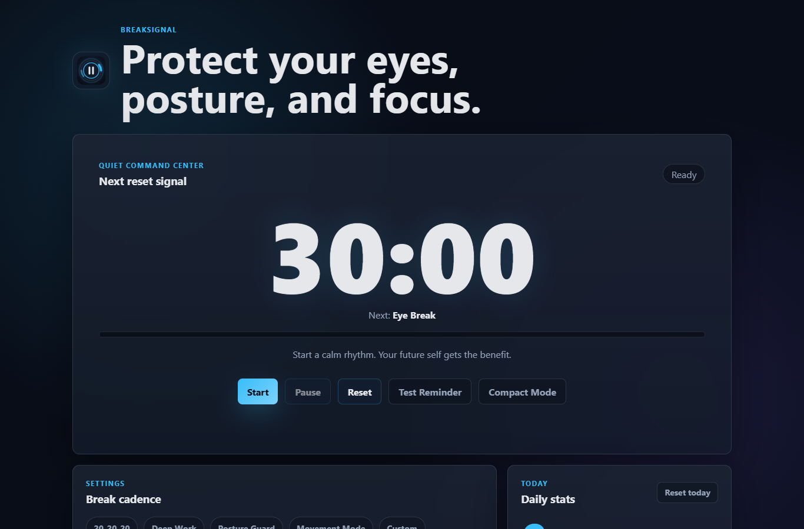
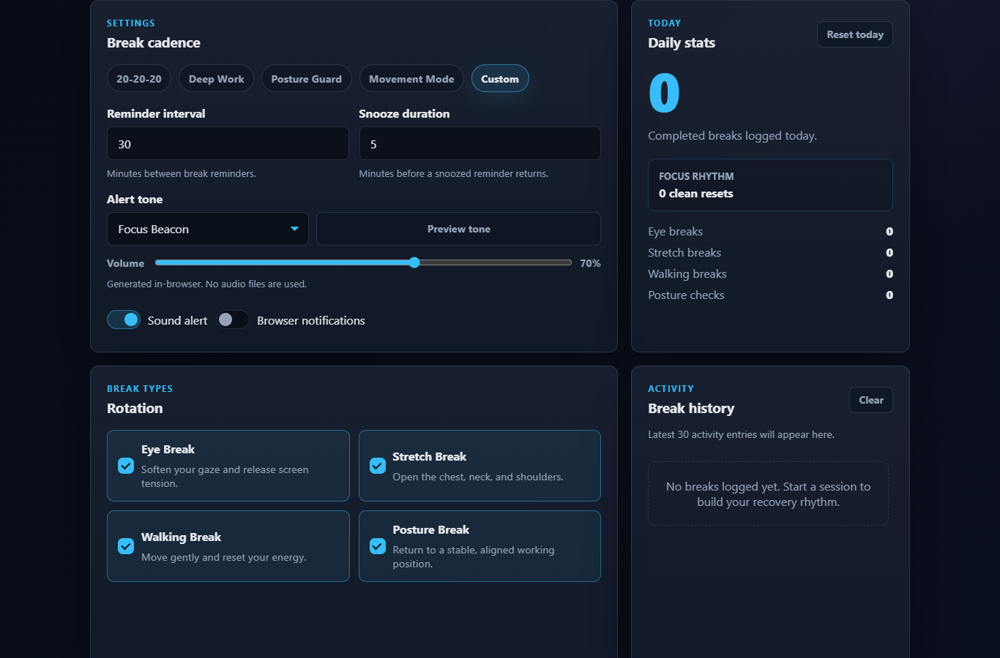
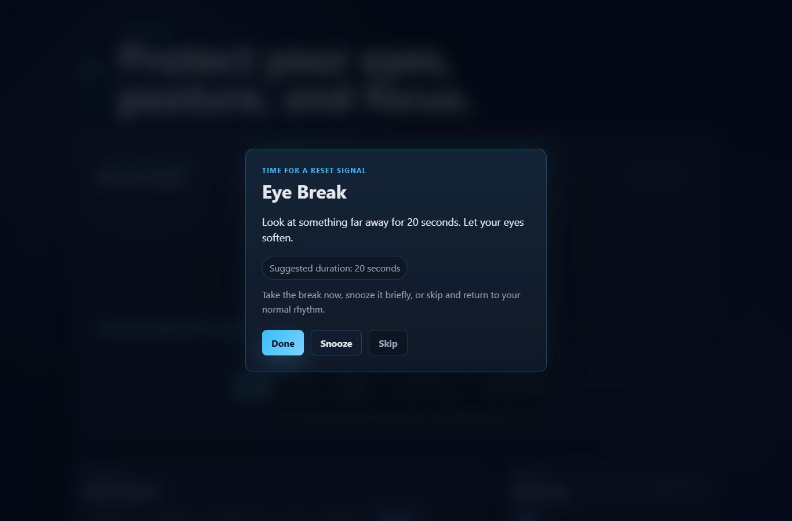
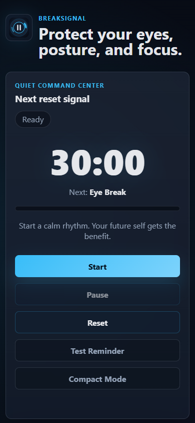

# BreakSignal

BreakSignal is a minimal static web app that helps users protect their eyes, posture, and focus by reminding them to take healthy breaks while working at a computer.

The app runs entirely in the browser using plain HTML, CSS, and JavaScript. It saves settings and break history with localStorage and is designed for deployment as a static website on Amazon S3.

## Live Demo

https://www.break-signal.com/

## Screenshots

### Dashboard



### Settings



### Break Reminder Modal



### Mobile Layout



## Features

- Countdown break reminder timer
- Eye, stretch, walking, and posture break rotation
- 20-20-20 eye break preset
- Custom reminder intervals and snooze duration
- Multi-theme visual selector with saved preference
- Rotating built-in break messages
- Browser-generated alert tones with grouped tone presets and volume control
- Optional browser notifications
- Progressive Web App install support
- Compact timer mode
- Daily completed-break counter with break-type breakdown
- Focus rhythm streak counter
- Recent break history saved locally
- Responsive dark futuristic interface

## Tech Stack

- HTML
- CSS
- Vanilla JavaScript
- localStorage
- Web Audio API
- Browser Notifications API
- Service Worker API
- AWS S3 Static Website Hosting

## Architecture

BreakSignal is a fully static browser app.

The app uses:

- HTML for structure
- CSS for layout and styling
- Vanilla JavaScript for timer logic, browser notifications, sound alerts, settings, and history
- localStorage for saving user preferences and recent activity
- A web manifest and service worker for install support and offline app-shell caching

No backend, database, authentication, or external API is required.

## How The App Works

BreakSignal runs a timer while the browser tab is open. When the timer reaches zero, it opens a break reminder modal with the next enabled break type. The user can mark the break as completed, snooze it, or skip it.

The app does not require a backend, database, account, or external API. Closing the tab stops the timer, but preferences and recent activity stay saved in the browser.

## localStorage

BreakSignal uses localStorage to save:

- Reminder interval
- Snooze duration
- Enabled break types
- Selected preset
- Selected visual theme
- Compact mode preference
- Sound tone and volume
- Notification preference
- Daily break count and break-type stats
- Focus rhythm streak
- Recent break history

## Browser APIs

### Web Audio API

Alert tones are generated in the browser with the Web Audio API. No external audio files are loaded.

### Browser Notifications API

Users can optionally enable browser notifications. Permission is requested only when the notification toggle is enabled.

### Progressive Web App

BreakSignal includes a web manifest, install icons, and a service worker. Supported browsers can install it as a standalone app while keeping all data local to the browser.

## Project Structure

```text
BreakSignal/
|-- www/
|   |-- index.html
|   |-- style.css
|   |-- script.js
|   |-- manifest.json
|   |-- service-worker.js
|   |-- logo.svg
|   `-- icons/
|-- assets/
|   |-- screenshots/
|   |-- icon-background.png
|   |-- icon-foreground.png
|   |-- icon-only.png
|   |-- splash.png
|   `-- splash-dark.png
|-- android/
|-- scripts/
|   `-- generate_android_brand_assets.py
|-- capacitor.config.json
|-- package.json
`-- README.md
```

## Android Brand Asset Workflow

BreakSignal uses Capacitor Assets to generate Android launcher icons and splash screens from source images in the root `assets/` folder.

### Source Assets

The required source files are:

```text
assets/icon-only.png
assets/icon-foreground.png
assets/icon-background.png
assets/splash.png
assets/splash-dark.png
```

These files generate Android launcher icons, adaptive icon layers, splash images, and night-mode splash resources.

Icon source files should be at least `1024 x 1024 px`. Splash source files should be at least `2732 x 2732 px`.

### Install Dependencies

Install the project dependencies before generating assets:

```bash
npm install
```

The source-asset script also requires Pillow. Install it if needed:

```bash
python -m pip install pillow
```

### Regenerate Source Assets

Generate the BreakSignal icon and splash source images:

```bash
npm run assets:source
```

This runs:

```bash
python scripts/generate_android_brand_assets.py
```

The script uses BreakSignal's dark futuristic brand colors and writes the source images to `assets/`.

### Generate Android Resources

After regenerating the source assets, generate the native Android icon and splash resources:

```bash
npm run assets:android
```

This runs:

```bash
npx capacitor-assets generate --android
```

Generated resources are written inside `android/app/src/main/res/`.

### Sync Capacitor

After changing web files or Capacitor assets, sync the Android project:

```bash
npm run android:sync
```

This runs:

```bash
npx cap sync android
```

The sync keeps the native Android project aligned with the current `www/` files and Capacitor configuration.

### Test The Result

Open the `android/` folder in Android Studio or run:

```bash
npm run cap:open:android
```

Test on an emulator or physical Android device and check:

- App icon appears correctly
- Splash screen appears correctly
- Dark splash background matches BreakSignal branding
- App launches and the timer screen loads
- Web-only UI is hidden inside Android
- Sound preview still works
- Settings still save with localStorage

Android 12 and newer use a system splash screen with a smaller centered icon and background color, so the launch screen may not look exactly like a full-screen image on every Android version.

BreakSignal's native launch theme uses the dark background color `#070B14` to match the main interface.

## AWS Deployment

BreakSignal is designed as a static website that can be hosted on Amazon S3. Since the app runs fully in the browser and uses localStorage for persistence, it does not require a backend server or database.

This makes it a beginner-friendly AWS portfolio project because it demonstrates static hosting, browser-side state management, and a clean deployment path.

Basic deployment steps:

1. Create an S3 bucket.
2. Enable static website hosting.
3. Upload the contents of `www/` as static files.
4. Set `index.html` as the index document.
5. Configure public access for simple testing.
6. Point a custom domain at the hosted site when ready.

## AWS Hosting Model

Current hosting model:

```text
User Browser -> Amazon S3 Static Website Hosting -> HTML/CSS/JS
```

Future production model:

```text
User Browser -> CloudFront -> Private S3 Bucket
```

Optional future infrastructure:

- Route 53 for DNS
- AWS Certificate Manager for HTTPS
- CloudFront Origin Access Control
- Terraform for infrastructure as code

## Google Play Store Deployment

BreakSignal includes a Capacitor Android wrapper for a future Google Play release. The preparation branch does not create signing credentials, signed APKs, or signed Android App Bundles.

Play Store metadata:

- Privacy policy: https://www.break-signal.com/privacy.html
- Support email: support@break-signal.com
- Support website: https://www.break-signal.com/

Play Store preparation documents:

- [Preparation instructions and status](PLAY_STORE_PREPARATION_INSTRUCTIONS.md)
- [Manual deployment process](PLAY_STORE_DEPLOYMENT.md)
- [Privacy policy](PRIVACY_POLICY.md)
- [Google Play Data Safety notes](PLAY_STORE_DATA_SAFETY.md)
- [Store listing draft](PLAY_STORE_LISTING_DRAFT.md)
- [Screenshot plan](PLAY_STORE_SCREENSHOT_PLAN.md)
- [Screenshot captions and feature graphic plan](play-store-assets/metadata/screenshot-captions.md)
- [Closed testing checklist](CLOSED_TESTING_CHECKLIST.md)
- [Content rating notes](PLAY_STORE_CONTENT_RATING_NOTES.md)

Final Play Store screenshots and the feature graphic should be captured or created from the release-candidate Android build and reviewed before upload. Do not commit placeholder image files.

## Future AWS Upgrade Path

This project can later be upgraded with:

- Amazon CloudFront for CDN delivery
- Origin Access Control to keep the S3 bucket private
- AWS Certificate Manager for HTTPS
- Route 53 for custom domain DNS
- Terraform for infrastructure as code

## Future Cloud Architecture

A more production-ready version could use:

- Amazon S3 as a private origin
- Amazon CloudFront as the CDN
- Origin Access Control to protect the bucket
- AWS Certificate Manager for HTTPS
- Route 53 for DNS
- Terraform to manage the infrastructure

## Version

1.0.0

## What Was Learned

- Building a useful app with only static files
- Managing browser-side state with localStorage
- Using the Web Audio API for generated sounds
- Handling Browser Notifications API permissions
- Designing responsive UI without a framework
- Preparing a static front-end project for AWS hosting
